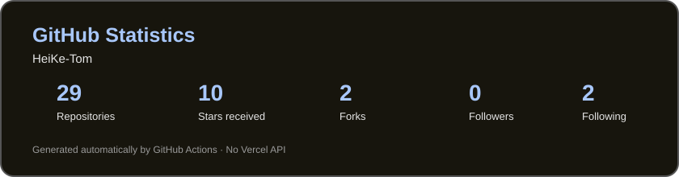
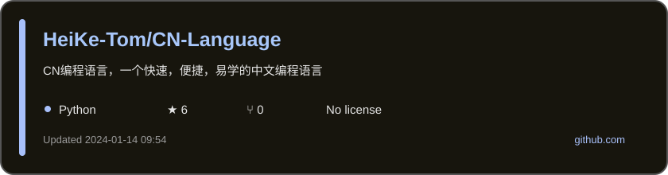
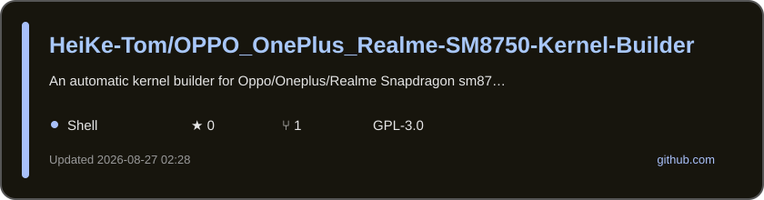

## 你好! 

这里是HeiKe-Tom的GitHub主页，一名业余Windows，安卓开发/内核技术爱好者。

- 🔭 目前主攻方向：安卓/Linux内核源码开发，安卓自定义技术，内核编译自动化工具/流程优化
- 🌱 擅长的语言：C / C++ / Shell / Python / Java
- 📫 我的酷安ID：@TomHjy

  

<picture>
  <source srcset="https://raw.githubusercontent.com/HeiKe-Tom/HeiKe-Tom/snake/github-contribution-grid-snake-dark.svg" media="(prefers-color-scheme: dark)">
  
</picture>

### 技能与工具
</h2>

  <!-- 使用更美观的动态技能图标 -->
  
  
  <!-- 添加技能动画卡片 - 改进布局 -->
  

### 我的个人作品：（更多代码开发中）

##
### 主页+项目访客统计（26.08.14——至今）

